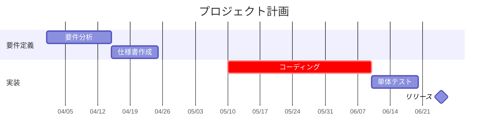

# MermaidAssist

Mermaid記法のガントチャートをGUIで直感的に編集できる、単一HTMLファイルのデスクトップツール。

Mermaidテキストをソースオブトゥルースとしながら、ドラッグ操作・プロパティパネル・プリセット選択でチャートを編集でき、変更は即座にMermaidテキストに書き戻されます。

## 特徴

- **単一HTMLファイル** — ブラウザで開くだけ。インストール不要、オフライン動作
- **3ペインUI** — エディタ／プレビュー＋オーバーレイ／プロパティパネル
- **タスクバーの直接操作** — ドラッグで日付変更、左右ハンドルでリサイズ、ホバー＆ドラッグ時の視覚フィードバック
- **プロパティパネル** — ラベル、ID、開始日、終了日、ステータス（done/active/crit/milestone）、after依存、セクション移動、↑↓順序変更
- **セクション管理** — セクション一覧表示、追加、削除（タスクごと）
- **axisFormatプリセット** — 日付フォーマットをプレビュー付きで選択（カスタム入力も可）
- **エクスポート** — `.mmd` 保存、SVG、PNG（透過対応）、クリップボードコピー
- **Undo/Redo** — 最大80件
- **キーボードショートカット** — `Ctrl+Z`/`Ctrl+Y` (Undo/Redo), `Ctrl+S`/`Ctrl+O` (保存/読込), `Delete` (削除), `Ctrl+C`/`Ctrl+V` (コピー/ペースト), `Ctrl+A` (全選択), `Esc` (選択解除)

## 使い方

1. リポジトリをクローン
   ```bash
   git clone https://github.com/KawanoMomo/mermaid-assist.git
   cd mermaid-assist
   ```
2. `mermaid-assist.html` をブラウザで開く

ローカルのみで動作し、ネットワーク通信はWebフォントの取得（Google Fonts）以外行いません。

## 対応する Mermaid Gantt 構文



ステータス: `done`, `active`, `crit`, `milestone`
依存指定: `after <id>`
日付形式: `YYYY-MM-DD`（厳格）

## 開発

```bash
# Playwright のインストール（初回のみ）
npm install
npx playwright install chromium

# ユニットテスト
node tests/run-tests.js

# E2Eテスト
npx playwright test

# 全テスト
npm run test:all
```

## アーキテクチャ

| 構成要素 | 役割 |
|---|---|
| 独自パーサー | Mermaidテキストから編集用構造化データを抽出（行番号付き） |
| mermaid.js | SVGプレビュー描画 |
| オーバーレイ層 | mermaid SVG上に透明な操作要素を重畳 |
| Regex Updater | GUI操作をMermaidテキストに書き戻し（書き込み時正規化） |

詳細は `docs/superpowers/specs/2026-03-30-mermaid-assist-design.md` を参照。

## ライセンス

MIT License — 詳細は [`LICENSE`](LICENSE) を参照。

このソフトウェアは [mermaid.js](https://github.com/mermaid-js/mermaid) (MIT License) を同梱しています。詳細は [`lib/LICENSE.mermaid`](lib/LICENSE.mermaid) を参照。
