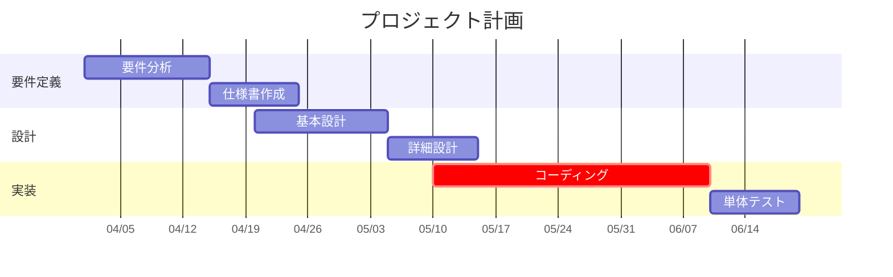

# MermaidAssist 設計仕様書

**日付:** 2026-03-30
**ステータス:** Draft
**対象:** E:\00_Git\05_MermaidAssist

## 1. コンセプト

Mermaidテキストをソースオブトゥルースとし、GUIで直感的に編集できるツール。初回リリースはガントチャートに対応。図種はモジュール構造で拡張可能。

StableBlockの実証済みアーキテクチャ（単一HTML、バニラJS、グローバル状態管理）を基盤に、mermaid.js描画＋透明オーバーレイ層でインタラクションを実現する。

## 2. 全体アーキテクチャ

### 2.1 データフロー

```
Mermaidテキスト (Source of Truth)
         │
    ┌────┼────────────┐
    ▼    ▼            ▼
 Parser  mermaid.js   Regex Updater
 (独自)  render       (GUI操作→テキスト)
    │       │            ▲
    ▼       ▼            │
 Parsed  SVG Output   GUI操作
 Data       │         (drag等)
    │       ▼
    ▼    Overlay
 Property  Builder
 Panel
```

- **独自パーサー**: Mermaidテキストから編集用データ（タスク名、日付、セクション等）を抽出
- **mermaid.js**: SVGプレビューを描画（MITライセンス、ローカルバンドルでオフライン動作）
- **オーバーレイ層**: mermaid.js描画SVG上に透明な操作要素を重ねる
- **Regex Updater**: GUI操作をMermaidテキストに書き戻す（書き込み時正規化, ADR-006準拠）

### 2.2 図種モジュール構造

```javascript
DiagramModule = {
  type:        "gantt"              // 図種識別子
  detect(text) → bool               // Mermaidテキストから図種判定
  parse(text)  → ParsedData         // 独自パーサー（編集用データ抽出）
  buildOverlay(svg, parsed) → DOM   // SVG上のオーバーレイ生成
  renderProps(sel, parsed) → DOM    // プロパティパネル生成
  updateText(text, change) → text   // Regex-based テキスト更新
  exportMmd(parsed) → text          // 正規化Mermaid出力
}
```

初回リリースでは `gantt` モジュールのみ実装。将来の拡張（sequence, flowchart等）は同インターフェースで追加可能。

### 2.3 ADR適用ポイント

| ADR | 適用箇所 |
|-----|---------|
| ADR-001 | DOM-basedイベント処理 → オーバーレイ要素に `data-task-id` 属性、ブラウザイベント伝播を利用 |
| ADR-002 | 選択モデルは StableBlock と統一 → `sel = [{type, id}, ...]` |
| ADR-003 | タスクの一意識別にDSL行番号を使用 → parse時に `line` プロパティ付与 |
| ADR-006 | GUI操作時にMermaidテキストを正規化して書き戻し（書き込み時正規化） |

## 3. ガントチャートモジュール詳細

### 3.1 対応するMermaid Gantt構文



### 3.2 IDなしタスクの扱い

MermaidではタスクにIDを省略できる（例: `要件分析 :2026-04-01, 2026-04-15`）。この場合、パーサーが自動的に `__auto_1`, `__auto_2`, ... の仮IDを付与する。仮IDはGUI操作・選択管理に使用し、テキストへの書き戻し時には含めない（元のID無し形式を維持）。

### 3.3 パーサー出力データ構造

```javascript
{
  title: "プロジェクト計画",
  dateFormat: "YYYY-MM-DD",
  axisFormat: "%m/%d",
  sections: [
    { name: "要件定義", line: 5 },
    { name: "設計",     line: 9 },
  ],
  tasks: [
    {
      id: "a1",
      label: "要件分析",
      status: null,          // "done" | "active" | "crit" | null
      startDate: "2026-04-01",
      endDate: "2026-04-15",
      after: null,           // 依存先ID (例: "a1")
      line: 6,               // DSL行番号 (ADR-003)
      sectionIndex: 0
    },
    {
      id: "a2",
      label: "仕様書作成",
      status: null,
      startDate: null,       // after指定の場合はnull
      endDate: "2026-04-25",
      after: "a1",
      line: 7,
      sectionIndex: 0
    },
  ]
}
```

### 3.3 オーバーレイ層の設計

1. mermaid.js描画SVG内の `<rect>` 要素を収集（ガントバーはrectで描画）
2. 各rectの `getBBox()` で位置・サイズ取得
3. `parsed.tasks` と描画順序で対応付け（mermaid.jsはtasksを定義順に描画する前提。実装初期に実際のSVG出力で検証し、順序が異なる場合はラベルテキストマッチングにフォールバック）
4. 各タスクに対し透明オーバーレイ要素を生成:
   - `data-task-id`, `data-type`, `data-line` 属性付き（ADR-001）
   - 左右にリサイズハンドル配置
   - 選択中タスクにはハイライト枠（破線、#7ee787）

### 3.4 日付⇔ピクセル変換

```
calibrateScale(svgElement, parsed):
  既知の2タスク（開始日が異なるもの）のrect.xを取得
  → pxPerDay = (rect2.x - rect1.x) / daysBetween(task1.start, task2.start)
  → originX  = rect1.x - daysBetween(baseDate, task1.start) * pxPerDay

pxToDate(px):  baseDate + (px - originX) / pxPerDay → 日単位に丸め
dateToPx(date): originX + daysBetween(baseDate, date) * pxPerDay
```

フォールバック: タスクが1件以下やすべて同一開始日の場合はSVGの軸ラベルテキストからスケールを推定。

### 3.5 GUI操作→テキスト更新の対応

| GUI操作 | テキスト更新 | 更新方式 |
|---------|------------|---------|
| バー左端ドラッグ | 開始日を変更 | 行番号でマッチ → 日付置換 |
| バー右端ドラッグ | 終了日を変更 | 行番号でマッチ → 日付置換 |
| バー全体ドラッグ | 開始日・終了日を同時変更 | 行番号でマッチ → 両日付置換 |
| プロパティパネルで編集 | 該当フィールドを変更 | 行番号でマッチ → フィールド置換 |
| タスク追加ボタン | セクション末尾に行追加 | セクション末尾行を特定 → 挿入 |
| タスク削除 | 該当行を削除 | 行番号でマッチ → 行削除 |

GUI操作ではテキストを開始日・終了日の明示的指定形式（`YYYY-MM-DD, YYYY-MM-DD`）で書き戻す。

## 4. UI詳細

### 4.1 画面レイアウト

```
┌─────────────────────────────────────────────────────┐
│ Toolbar: Logo | Open Save | Undo Redo | Zoom | Export│
├──────────┬────────────────────┬──────────────────────┤
│ Editor   │ Preview Area       │ Property Panel       │
│ (30%)    │ (flex)             │ (220px)              │
│          │                    │                      │
│ textarea │ mermaid.js SVG     │ タスク編集フォーム    │
│ + 行番号  │ + Overlay Layer    │                      │
│          │                    │                      │
├──────────┴────────────────────┴──────────────────────┤
│ Status: パースOK | タスク:5 | セクション:3 | 期間    │
└─────────────────────────────────────────────────────┘
```

### 4.2 プロパティパネルの状態遷移

| 選択状態 | パネル表示 |
|---------|-----------|
| 未選択 | タスク追加フォーム + セクション追加 + ショートカット一覧 |
| タスク1件選択 | タスク名 / ID / 開始日 / 終了日 / 状態(done,active,crit) / セクション / 依存(after) / 削除ボタン |
| タスク複数選択 | 一括状態変更 / 一括日付シフト / 一括削除 |
| セクション見出し選択 | セクション名編集 / セクション内タスク一覧 / セクション削除 |

### 4.3 キーボードショートカット

| キー | 動作 |
|------|------|
| Ctrl+Z / Ctrl+Y | Undo / Redo |
| Ctrl+S | .mmdファイル保存 |
| Ctrl+O | .mmdファイル読み込み |
| Delete | 選択タスク削除 |
| Shift+Click | 複数タスク選択 |
| Ctrl+A | 全タスク選択（プレビューフォーカス時） |
| Escape | 選択解除 |
| Ctrl+C / Ctrl+V | タスクコピー / ペースト |

### 4.4 ズーム & スクロール

| 操作 | 動作 |
|------|------|
| Ctrl + ホイール | ズームイン / アウト（25%〜300%） |
| ホイール | 縦スクロール |
| Shift + ホイール | 横スクロール（ガントの時間軸方向） |

## 5. リフレッシュパイプライン

```
テキスト入力 / GUI操作
       │
       ▼
pushHistory(mmdText)
       │
       ▼
debounce 300ms
       │
       ├──────────────────┐
       ▼                  ▼
  module.parse()     mermaid.js render(svg)
  → parsed data      → SVG Element
       │                  │
       └────────┬─────────┘
                ▼
  buildOverlay(svg, parsed)
  → 透明操作層を生成
                │
       ┌────────┼────────┐
       ▼        ▼        ▼
 syncEditor  renderProps  renderStatus
```

- mermaid.jsのrenderは非同期（async）。パース結果と合流してからオーバーレイ構築。
- GUI操作起点の場合は `suppressSync=true` でエディタへの再帰書き込みを防止。
- Undoスタックは最大80件。

### 5.1 グローバル状態変数

```javascript
// ソースオブトゥルース
mmdText         // Mermaidテキスト

// パース結果
parsed          // { title, dateFormat, axisFormat, sections[], tasks[] }

// UI状態
sel[]           // 選択中 [{type:"task"|"section", id}] (ADR-002)
zoom            // 0.25 ~ 3.0
history[]       // Undo スタック (max 80)
future[]        // Redo スタック

// 図種モジュール
currentModule   // 現在アクティブな DiagramModule
modules{}       // { gantt: GanttModule, ... }

// 同期制御
suppressSync    // エディタ↔プレビュー再帰防止フラグ
debounceTimer   // デバウンス用タイマーID (300ms)
```

## 6. ファイル構成

```
05_MermaidAssist/
├── mermaid-assist.html        ← 単一ファイル版（メイン成果物）
├── lib/
│   └── mermaid.min.js         ← mermaid.js バンドル (MIT)
├── CLAUDE.md                  ← 開発ガイド
├── README.md
├── VERSION
├── LICENSE                    ← MITライセンス + mermaid.js帰属表記
├── docs/
│   └── ecn/                   ← Engineering Change Notices
└── tests/
    ├── gantt-parser.test.js   ← パーサー単体テスト
    ├── gantt-updater.test.js  ← テキスト更新テスト
    └── run-tests.js
```

## 7. エクスポート機能

| 形式 | 実装方式 | 備考 |
|------|---------|------|
| .mmd保存 | mmdTextをBlob化 → ダウンロード | Ctrl+S |
| SVG | mermaid.js描画SVGをシリアライズ（オーバーレイ除去） | |
| PNG | SVG → Image → Canvas → toDataURL | |
| PNG (透過) | 背景fill無しでCanvas描画 | |
| PNG → クリップボード | Canvas → Blob → ClipboardItem | Ctrl+Shift+C or ボタン |

ファイル読み込みは .mmd / .mermaid / .txt に対応。

## 8. テスト戦略

### 8.1 テストファイル構成

- **gantt-parser.test.js**: 基本構文パース、タスク各形式、行番号正確性(ADR-003)、エラーケース、エッジケース
- **gantt-updater.test.js**: 各GUI操作→テキスト変更の正確性、round-tripテスト（パース→更新→再パース整合性）
- **run-tests.js**: Node.jsカスタムテストランナー（StableBlock踏襲）

### 8.2 テスト対象外

- オーバーレイ・UIテスト: ブラウザ手動確認（単一HTML版のため）

## 9. ADR追加予定

| ADR | タイトル | 概要 |
|-----|---------|------|
| ADR-008 | mermaid.js SVGオーバーレイ方式 | mermaid.js描画 + 透明オーバーレイ層でインタラクション実現。自前描画やDOM直接操作ではなくオーバーレイを選択した理由。 |
| ADR-009 | 図種モジュール構造 | DiagramModuleインターフェースによる図種拡張。detect/parse/buildOverlay/renderProps/updateTextの責務分割。 |
| ADR-010 | 日付⇔ピクセル変換のキャリブレーション | mermaid.js SVGから既知タスクのrect位置を使ってスケールを逆算。軸ラベルフォールバック。 |

## 10. 初回リリーススコープ

### スコープ内

- 単一HTMLファイル版（mermaid-assist.html）
- ガントチャート対応（DiagramModuleのgantt実装）
- 3ペインUI（エディタ / プレビュー+オーバーレイ / プロパティパネル）
- バードラッグ（移動・リサイズ）で開始日・終了日編集
- プロパティパネルでフォーム編集
- エクスポート（.mmd / SVG / PNG / PNG透過 / クリップボード）
- Undo/Redo (max 80)
- 300msデバウンスプレビュー
- 依存関係GUI操作（after）— 優先度低、後回し

### スコープ外（将来）

- VSCode拡張
- 他図種モジュール（sequence, flowchart等）
- MCP Server統合
